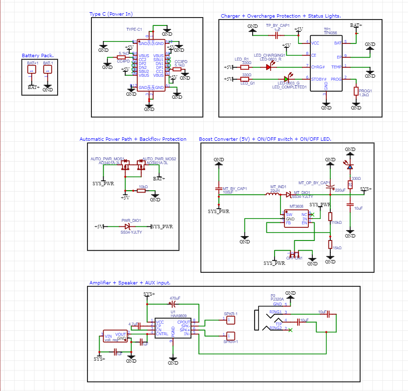
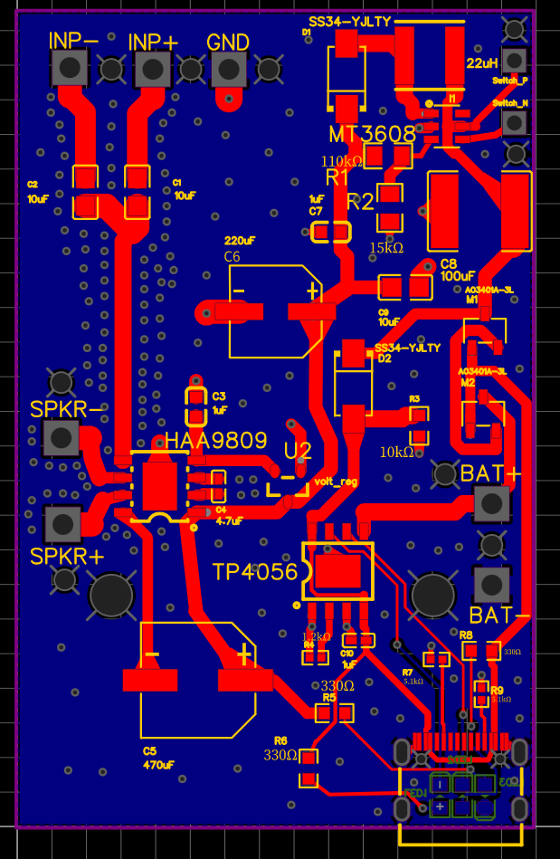
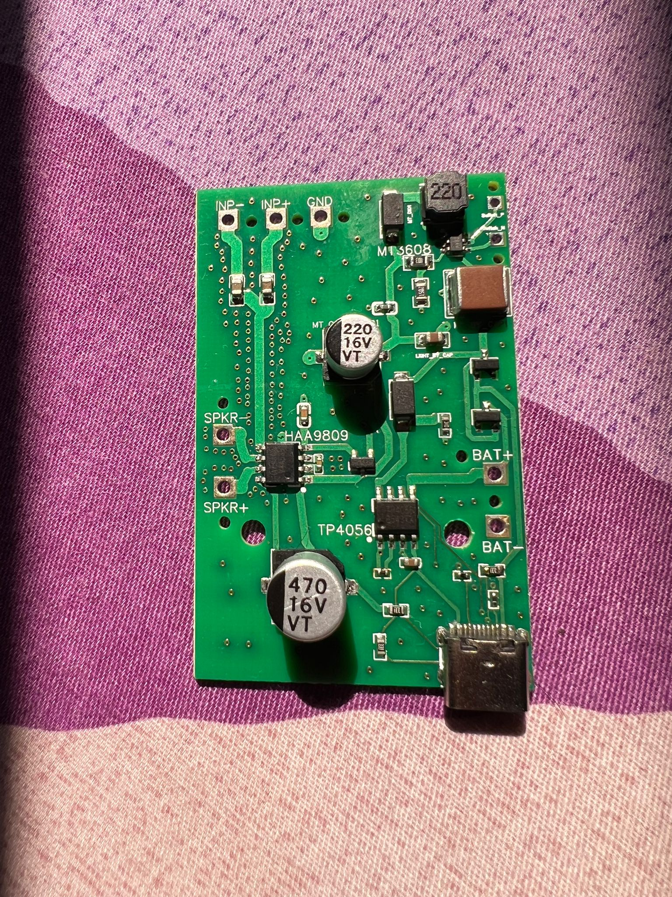

# 🔊 Portable Audio Amplifier PCB: Low-Noise Design & Power Management 🔋

| Schematic | PCB Layout | Fabricated PCB |
|----------|-------------|----------------|
| |  |  |

This repository showcases the complete 2-layer PCB design for a compact, portable audio amplifier, integrating robust power management with a high-fidelity audio stage. The project focuses on solving critical challenges in **mixed-signal design** to ensure a clean audio output despite operating alongside noisy switching power electronics.

## **Key Features & Technologies**

* **Class-D Audio Amplification:** Features the **HAA9809** for efficient, low-noise audio output, ideal for portable applications.
* **Intelligent Power Management:**
    * **TP4056** Li-ion charging controller for safe 1A battery charging.
    * **Automatic Power Path:** Seamlessly switches between USB and battery power using **back-to-back MOSFETs** and a Schottky diode.
    * **DC-DC Boost Conversion:** Utilizes the **MT3608** to efficiently boost battery voltage (3.0V-4.2V) to a stable 5V for the amplifier.
* **Compact & Manufacturable Design:** A 2-layer PCB optimized for size, ease of assembly, and cost-effective fabrication.

## **Design Philosophy & Engineering Challenges Solved**

This project was a deep dive into practical mixed-signal PCB design, focusing on mitigating noise and ensuring robust power delivery.

### **1. EMI Mitigation & Noise Isolation**

The primary challenge was preventing high-frequency switching noise from the **MT3608 boost converter** from corrupting the sensitive analog audio signals.

* **Strategic Component Placement:** Physically separated the noisy power section (boost converter, charging) from the sensitive audio section (amplifier, audio inputs) across the board.
* **Dedicated Grounding Strategy:** Implemented a multi-pronged approach to ground integrity:
    * **Unified Ground Plane:** Utilized a continuous bottom-layer ground plane as the primary return path.
    * **Extensive Ground Stitching:** Liberally added **ground stitching vias** throughout the board to "weld" fragmented ground plane sections, ensuring a low-impedance, unified ground reference.
    * **Via Fencing:** Created a **"picket fence" of ground vias** running parallel to the sensitive audio input traces, actively shielding them from external noise coupling.

### **2. High-Current Power Delivery**

Ensuring stable voltage and minimal power loss for both the amplifier and battery management was critical.

* **Optimized Trace Widths:** Implemented **exceptionally wide traces** for all high-current paths (battery input, boost converter power rails, speaker outputs) to minimize voltage drop and prevent trace heating.
* **Tight Switching Loop:** The MT3608's input capacitor, inductor, and output diode/capacitor were placed extremely close to the IC, using short, wide traces to minimize parasitic inductance and EMI radiation from the high-frequency switching node.

### **3. Design for Manufacturability (DFM)**

The PCB was designed with fabrication and assembly in mind:

* **Standard 2-Layer Board:** Ensures cost-effective manufacturing.
* **Through-Hole Connectors:** All external connections (power input, battery, speakers, AUX) utilize robust through-hole pads for reliable soldering and repeated use.
* **Clear Silkscreening:** Component labels and polarity indicators ensure correct assembly.

